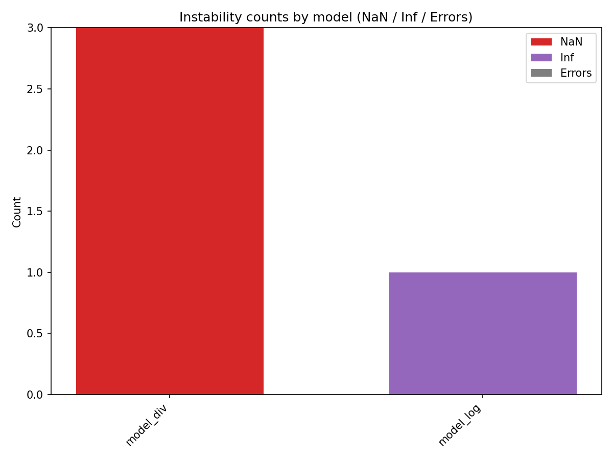
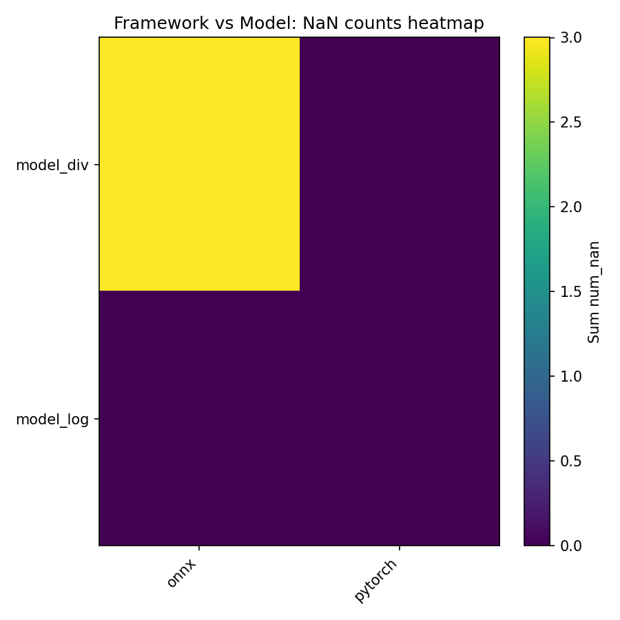

# Numerical Instabilities for AI Compilers — FPGen + KLEE pipeline

Project summary
--
Automated pipeline to find and compare numerical instabilities (NaN / Inf / overflow / underflow / errors) across operators and AI runtimes. Uses FPGen/KLEE to generate edge-case inputs, exports small operator-composition models (PyTorch -> TorchScript + ONNX), runs them on multiple backends (PyTorch, ONNX Runtime; optional TVM/TensorRT), and aggregates results into CSV/Markdown and PNG visualizations suitable for portfolio display.

Key deliverables in this repository
--
- Model generation scripts (`tools/build_and_export_composed_models.py`)
- ONNX evaluation and summarization (`tools/run_onnx_evaluator.py`, `tools/compute_summary_stats.py`)
- Multi-backend runner (`runners/run_multi_framework.py`)
- Cross-run aggregation (`runners/compare_summaries.py`)
- Visualizations (`tools/visualize_results.py`) and final `report/` with PNGs and CSVs

Quick reproduction (minimal)
--
Install requirements and run the small demo pipeline (use your venv python if available):

```bash
python -m pip install -r tools/requirements.txt
python tools/build_and_export_composed_models.py --out models/auto_generated --min-count 10 --combo-len 3
python tools/run_onnx_evaluator.py --models models/auto_generated/models_meta.json --inputs parsed_klee_inj_all --out results/models_eval
python tools/compute_summary_stats.py --dir results/models_eval --out results/models_summary
python runners/compare_summaries.py --root results/runs --out report
python tools/visualize_results.py --report-dir report --out-dir report
```

Notes
--
- FPGen/KLEE long runs should be executed inside the FPGen container for large-scale input generation.
- TVM / TensorRT require platform-specific setups (NVIDIA GPU, Linux); current repo will skip unavailable frameworks.

If you want me to create a local commit for pushing to GitHub (excluding large artifacts) say `commit` and I will prepare the `.gitignore` and a focused commit.
# Numerical Instabilities for AI compilers — FPGen + KLEE workflow

项目简介
--
这是一个用于发现并比较 AI 框架 / 编译器在常用运算子（如 div/log/exp/pow/softmax 等）上数值不稳定性的工程化项目。核心思路是：使用 FPGen/KLEE 生成能触发数值异常（NaN/Inf/溢出/下溢）的输入，自动把这些输入喂到小型 operator-composition 模型（PyTorch / ONNX），并在多个运行时（ONNX Runtime、PyTorch、可选 TVM/TensorRT）上评估差异，最后汇总并可视化结果。

要点（适合作为简历项目描述）
- 使用符号执行（KLEE / FPGen）自动生成触发边界数值行为的测试输入。
- 自动生成 operator-composition 的小型模型（PyTorch -> TorchScript + ONNX），并批量导出（scripts 在 `tools/`）。
- 在多个后端（PyTorch / ONNX Runtime；TVM / TensorRT 为可选并按需运行）上执行这些输入，记录 NaN/Inf/错误等异常并做汇总比较。
- 自动化流水线：模型生成 → 运行器（runners）→ 汇总脚本 → 可视化（生成 PNG 报表）。

项目结构（重要文件）
- `tools/build_and_export_composed_models.py` — 自动组合操作并导出 TorchScript/ONNX
- `tools/run_onnx_evaluator.py` — 在 ONNX Runtime 上用解析好的 FPGen 输入评估模型
- `tools/compute_summary_stats.py` — 汇总 per-model JSON 为 CSV / Markdown
- `runners/run_multi_framework.py` — 统一入口，支持 `pytorch`, `torch_compile`, `onnx`（best-effort 支持 `tvm`, `tensorrt`）
- `runners/compare_summaries.py` — 聚合多次 run 的 `summary.json`，生成 `report/` 报表
- `tools/visualize_results.py` — 从 `report/aggregated_runs.csv` 生成可视化图像（PNG）
- `parsed_klee_inj_all/` — 已解析的 KLEE/FPGen 输入 CSV（样本数据或真正的解析输出）

关键结果快照
--
下面的图表来自 `report/`（在仓库中已生成）。它们说明了不同模型/框架在这些 FPGen 输入下触发 NaN/Inf/错误的分布：

Instability by model (NaN / Inf / Errors):



Framework vs Model NaN counts (heatmap):



最小复现（在本仓库根目录）
--
建议先使用项目的虚拟环境（下面示例使用已检测的 venv 路径），下面是最小可复现流水线：

1) 安装依赖（若尚未安装）：

```bash
/Users/xieyushan/Documents/code/.venv/bin/python -m pip install -r tools/requirements.txt
```

2) 生成少量自动组合模型（示例）：

```bash
/Users/xieyushan/Documents/code/.venv/bin/python tools/build_and_export_composed_models.py --out models/auto_generated --min-count 10 --combo-len 3
```

3) 使用已解析的 FPGen 输入（仓库中的 `parsed_klee_inj_all/`）在 ONNX Runtime 上评估并把结果写入 `results/models_eval/`：

```bash
/Users/xieyushan/Documents/code/.venv/bin/python tools/run_onnx_evaluator.py --models models/auto_generated/models_meta.json --inputs parsed_klee_inj_all --out results/models_eval
```

4) 汇总为 CSV / Markdown：

```bash
/Users/xieyushan/Documents/code/.venv/bin/python tools/compute_summary_stats.py --dir results/models_eval --out results/models_summary
```

5) （可选）运行多框架统一评测（会尝试使用 torchscript / onnx）：

```bash
/Users/xieyushan/Documents/code/.venv/bin/python runners/run_multi_framework.py --models models/auto_generated/models_meta.json --inputs "parsed_klee_inj_all/*/inputs.csv" --frameworks pytorch,onnx --out results/summary_multi
```

6) 聚合多次 runs（放到 `results/runs/<rundir>/summary.json`）并生成最终 `report/`：

```bash
/Users/xieyushan/Documents/code/.venv/bin/python runners/compare_summaries.py --root results/runs --out report
```

7) 生成图表（如果没有）：

```bash
/Users/xieyushan/Documents/code/.venv/bin/python tools/visualize_results.py --report-dir report --out-dir report
```

限制与备注（写进简历时可简述）
--
- KLEE/FPGen 与长时间符号执行通常需要在容器或专用主机中运行（仓库包含用于容器运行的脚本和注入 stub）。
- TVM / TensorRT 的测试需要特定平台（TensorRT 需要 NVIDIA GPU + Linux）；当前仓库在 macOS 下采用 best-effort 跳过模式。
- ONNX 导出使用 opset 11 与 TorchScript（兼容多数简单模型）；复杂控制流模型须额外处理。

准备提交到 GitHub（推荐步骤）
--
1) 确认哪些大文件需要提交（models/、report/、results/）——一般建议将大模型/数据文件加入 `.gitignore`，只提交小型示例与脚本；若要包含报告截图，可把 `report/*.png` 提交。
2) 生成一条简洁的 commit message，例如：

```bash
git add .
git commit -m "Add FPGen-based instability pipeline: model export, multi-framework evaluation, reports/visualizations"
git remote add origin git@github.com:<your-username>/numerical-instabilities.git
git push -u origin main
```

我可以代劳做一次 commit（或帮助生成 patch），但不会在没有你的允许下推送到远端仓库。

结束语
--
这个仓库已经包含从输入生成到跨框架评估与可视化的大部分流水线，适合作为一个展示工程自动化、符号执行与数值差异分析能力的简历项目。如果你同意，我可以帮你：

- 生成一个干净的 commit（仅包含代码与小量示例数据 + 报告截图）并输出可执行的 git 命令；或
- 生成一个 README 的英文版本用于 GitHub（现在是中文）；或
- 帮你把仓库打包并生成一个发布说明（release notes）。

请告诉我你更希望我怎么做（例如：现在就帮你生成 commit & 打包一个推送-ready 目录）。
# Numerical_Instabilities
