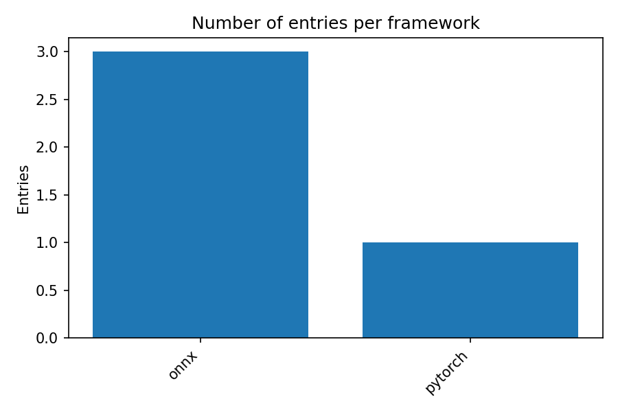
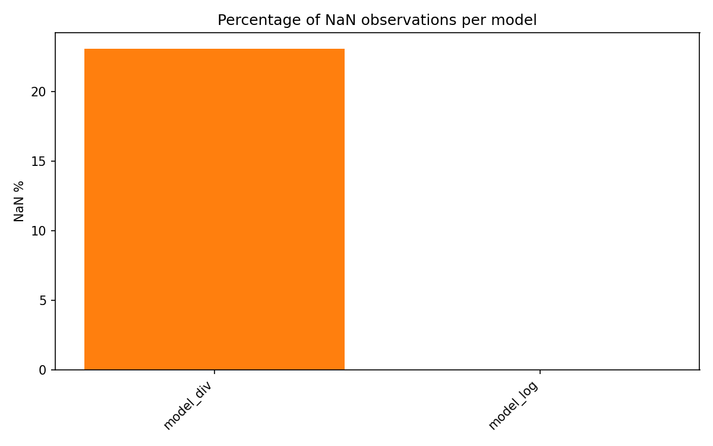

# Numerical Instabilities for AI Compilers — FPGen + KLEE pipeline

Project summary
--
Automated pipeline to find and compare numerical instabilities (NaN / Inf / overflow / underflow / errors) across operators and AI runtimes. Uses FPGen/KLEE to generate edge-case inputs, exports small operator-composition models (PyTorch -> TorchScript + ONNX), runs them on multiple backends (PyTorch, ONNX Runtime; optional TVM/TensorRT), and aggregates results into CSV/Markdown and PNG visualizations suitable for portfolio display.

Key deliverables in this repository
--
- Model generation scripts (`tools/build_and_export_composed_models.py`)
- ONNX evaluation and summarization (`tools/run_onnx_evaluator.py`, `tools/compute_summary_stats.py`)
- Multi-backend runner (`runners/run_multi_framework.py`)
- Cross-run aggregation (`runners/compare_summaries.py`)
- Visualizations (`tools/visualize_results.py`) and final `report/` with PNGs and CSVs

Quick reproduction (minimal)
--
Install requirements and run the small demo pipeline (use your venv python if available):

```bash
python -m pip install -r tools/requirements.txt
python tools/build_and_export_composed_models.py --out models/auto_generated --min-count 10 --combo-len 3
python tools/run_onnx_evaluator.py --models models/auto_generated/models_meta.json --inputs parsed_klee_inj_all --out results/models_eval
python tools/compute_summary_stats.py --dir results/models_eval --out results/models_summary
python runners/compare_summaries.py --root results/runs --out report
python tools/visualize_results.py --report-dir report --out-dir report
```

Notes
--
- FPGen/KLEE long runs should be executed inside the FPGen container for large-scale input generation.
- TVM / TensorRT require platform-specific setups (NVIDIA GPU, Linux); current repo will skip unavailable frameworks.

If you want me to create a local commit for pushing to GitHub (excluding large artifacts) say `commit` and I will prepare the `.gitignore` and a focused commit.

Key visualizations
--
Below are the main visualizations generated by the pipeline and included in `report/`. These images summarize which models and frameworks produced NaN/Inf/other errors when run with FPGen-generated inputs.

Instability by model (bar chart): shows per-model counts of NaN/Inf/errors.


Framework vs Model heatmap: compares NaN/Inf counts across frameworks for each model.


Framework totals (bar chart): aggregate counts of issues per framework.



Model NaN percentage: normalized view showing what fraction of inputs for each model produced NaN.


# Contact and next steps

If you'd like, I can:

- Prepare a focused `.gitignore` and create a local commit including code, README, and selected report images (excluding large FPGen outputs and raw models).
- Help generate a concise one-page README suitable for a GitHub project page or portfolio blurb.
- Package the repository for sharing or create release notes.

Say `commit` and I will prepare the `.gitignore` and a clean local commit (I will not push to any remote without your permission).
# Numerical_Instabilities
