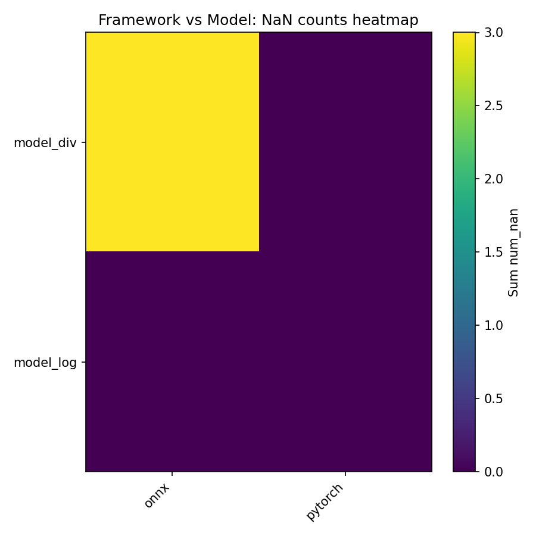

# Numerical Instabilities for AI Compilers — FPGen + KLEE Pipeline

Project overview
--
This repository implements an automated pipeline to discover and compare numerical instabilities (NaN / Inf / over/underflow / other runtime errors) across operators and AI runtimes/compilers. It uses FPGen/KLEE to generate edge-case inputs, exports small operator-composition models (PyTorch -> TorchScript + ONNX), runs these inputs across multiple backends (ONNX Runtime, PyTorch; TVM/TensorRT optional), and aggregates results into CSV/Markdown and visual visualizations.

Why this is interesting
--
- Demonstrates symbolic-execution-driven test generation for numerical edge cases.
- Automates cross-framework comparison (PyTorch vs ONNX Runtime, extendable to TVM / TensorRT).
- Produces reproducible reports and visualizations suitable for inclusion in a portfolio or CV.

What is included (key scripts & locations)
--
- `tools/build_and_export_composed_models.py` — compose simple operator models and export TorchScript + ONNX
- `tools/run_onnx_evaluator.py` — run ONNX models on parsed FPGen inputs with ONNX Runtime
- `tools/compute_summary_stats.py` — aggregate per-model JSON outputs into CSV / Markdown
- `runners/run_multi_framework.py` — single entry to evaluate models on `pytorch`, `torch_compile`, `onnx` (best-effort `tvm`, `tensorrt`)
- `runners/compare_summaries.py` — aggregate multiple run `summary.json`s into `report/` CSVs and a short summary
- `tools/visualize_results.py` — generate PNG visualizations from `report/aggregated_runs.csv`
- `parsed_klee_inj_all/` — sample/parsed KLEE inputs used in evaluation (or replace with your own parsed outputs)

Key result snapshots
--
The repository contains generated visualizations under `report/`. They are embedded here so reviewers can quickly inspect findings.

Instability counts by model (NaN / Inf / Errors):


Framework vs Model NaN counts (heatmap):



Quick reproduction (minimal)
--
These commands assume you are at the repository root. Prefer using a Python virtual environment. Replace `python` with your venv python (for example `.venv/bin/python`).

1) Install dependencies:

```bash
python -m pip install -r tools/requirements.txt
# or if you use the provided venv:
#.venv/bin/python -m pip install -r tools/requirements.txt
```

2) Generate a small set of example models (example):

```bash
python tools/build_and_export_composed_models.py --out models/auto_generated --min-count 10 --combo-len 3
```

3) Evaluate ONNX models with parsed FPGen inputs (if `parsed_klee_inj_all/` exists):

```bash
python tools/run_onnx_evaluator.py --models models/auto_generated/models_meta.json --inputs parsed_klee_inj_all --out results/models_eval
```

4) Aggregate ONNX evaluation outputs:

```bash
python tools/compute_summary_stats.py --dir results/models_eval --out results/models_summary
```

5) (Optional) Run the multi-framework runner (PyTorch + ONNX example):

```bash
python runners/run_multi_framework.py --models models/auto_generated/models_meta.json --inputs "parsed_klee_inj_all/*/inputs.csv" --frameworks pytorch,onnx --out results/summary_multi
```

6) Aggregate multiple runs and produce `report/` and visualizations:

```bash
python runners/compare_summaries.py --root results/runs --out report
python tools/visualize_results.py --report-dir report --out-dir report
```

Notes and limitations
--
- Generating many FPGen/KLEE inputs can be time-consuming and is typically run inside the FPGen Docker container (scripts exist in the repo to support container-side runs).
- TVM and TensorRT support are best-effort in this repo; TensorRT requires NVIDIA hardware and Linux. The repo will detect and skip unavailable frameworks but for full TVM/TensorRT experiments you should run on an appropriate machine or CI.
- ONNX exports here use opset 11 and a TorchScript-based exporter which is compatible with these small models; complex models with control flow may require a different export path.

Guidance for GitHub / resume presentation
--
- Include code, scripts, and a small `report/` with PNG visualizations and CSV summaries in the repository you publish. Omit large generated artifacts (full KLEE outputs, heavy model files) from git; use `.gitignore` to exclude them.
- Suggested `.gitignore` entries (add to repo root):
```
.venv/
__pycache__/
results/
parsed_klee_inj_all/
models/
*.tgz
```

- Commit example (local, then push):
```
git add .
git commit -m "Add FPGen/KLEE-based numerical instability pipeline, sample results and visualizations"
git remote add origin git@github.com:<your-username>/numerical-instabilities.git
git push -u origin main
```

If you want I can create the local commit for you (without pushing) or translate the README into a more concise one-page portfolio blurb for LinkedIn/GitHub.

Contact
--
If you want me to produce the final local commit now, say `commit` and I will: add a sensible `.gitignore`, create a single focused commit containing code + README + report images (no large artifacts), and print the commands for pushing to a remote.
