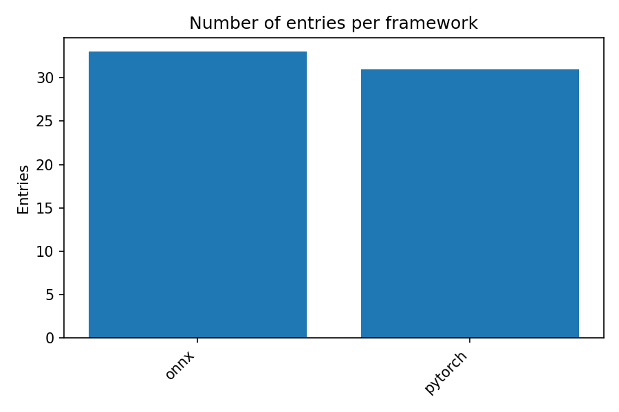
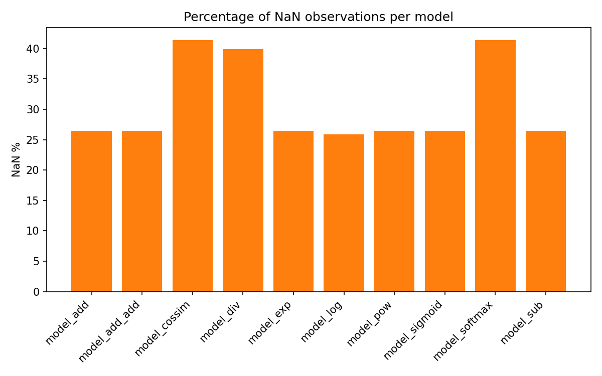

# Reporting & Visualization Guide

This folder stores every artifact needed to explain the numerical-instability experiments: aggregated CSV/MD summaries, exported PNG charts, and the dashboard bundle under `dashboard/`. Everything in here can be regenerated from the project root (`Numerical_instabilities/`).

## 📂 What lives here

- `aggregated_runs.csv` – canonical per-run / per-model / per-framework table
- `framework_diff.csv` – framework vs. model pivot of NaN/Inf/Error counts
- `summary.md` – human-readable recap that mirrors the CSVs
- `instability_by_op_bar.png`, `framework_diff_heatmap.png`, `framework_counts_bar.png`, `model_nan_percent.png` – key charts used in the presentation
- `dashboard/` – `dashboard_data.json` plus the static assets (`index.html`, `styles.css`, `app.js`)

## ⚡ One-command pipeline (recommended)

From the repository root:

```bash
bash run_pipeline.sh
# or specify a custom interpreter:
# PYTHON_BIN=.venv/bin/python bash run_pipeline.sh
```

The script bootstraps the Python environment, rebuilds composite models, runs every evaluator, aggregates results, refreshes all CSV/MD/PNG artifacts, and finally rewrites `report/dashboard/dashboard_data.json`. After it finishes you can serve the dashboard with `python -m http.server 8000` and visit `http://localhost:8000/report/dashboard/`.

## 🧭 Full pipeline (manual steps)

All commands assume you are inside `Numerical_instabilities/` with the virtual environment activated (e.g., `python3 -m venv .venv && source .venv/bin/activate`). Running `run_pipeline.sh` already performs steps 2–8 for you, but they are listed below for clarity or selective reruns.

1. **Install dependencies**
	```bash
	python -m pip install -r tools/requirements.txt
	```
2. **Build and export composed models**
	```bash
	python tools/build_and_export_composed_models.py \
	  --out models/auto_generated \
	  --min-count 10 \
	  --combo-len 3
	```
3. **Run the ONNX evaluator (single-framework statistics per input)**
	```bash
	python tools/run_onnx_evaluator.py \
	  --models models/auto_generated/models_meta.json \
	  --inputs parsed_klee_inj_all \
	  --out results/models_eval
	```
4. **Summarize evaluator outputs**
	```bash
	python tools/compute_summary_stats.py \
	  --dir results/models_eval \
	  --out results/models_summary
	```
5. **Execute multi-framework runs**
	```bash
	python runners/run_multi_framework.py \
	  --models models/auto_generated/models_meta.json \
	  --inputs "parsed_klee_inj_all/*/inputs.csv" \
	  --frameworks pytorch,onnx \
	  --out results/runs/run_latest
	```
6. **Aggregate every run into report-ready CSVs**
	```bash
	python runners/compare_summaries.py \
	  --root results/runs \
	  --out report
	```
7. **Regenerate the PNG charts**
	```bash
	python tools/visualize_results.py --report-dir report --out-dir report
	```
8. **Refresh the dashboard payload**
	```bash
	python tools/generate_dashboard.py \
	  --report-dir report \
	  --model-summary results/models_summary/models_summary.csv \
	  --out report/dashboard
	```
9. **View the dashboard locally**
	```bash
	python -m http.server 8000
	```
	Then open `http://localhost:8000/report/dashboard/` in your browser.

## 📊 Preview of bundled charts

Instability by model (NaN / Inf / Errors):


Framework vs. model NaN counts (heatmap):


Number of run entries per framework:



Percentage of NaN observations per model:



Images render directly in VS Code / GitHub once committed. If you only need to refresh the charts from existing CSVs, run `python tools/visualize_results.py --report-dir report --out-dir report` from the project root.

